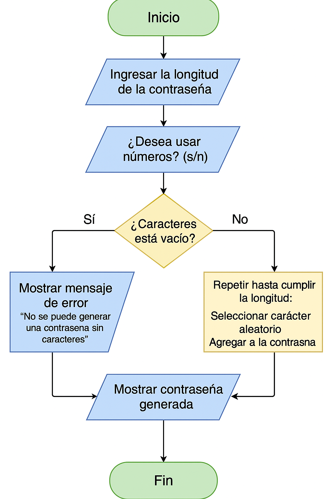

# Generador de Contraseñas en Python

Este proyecto es un **generador de contraseñas seguras** desarrollado en Python.  
Permite al usuario elegir la longitud de la contraseña y seleccionar si desea incluir:

- ✅ Letras
- ✅ Números
- ✅ Símbolos

El programa genera contraseñas aleatorias combinando los elementos seleccionados.

---

## Funcionalidades

- Solicita la longitud de la contraseña.
- Permite elegir qué tipos de caracteres usar.
- Valida que al menos una opción esté activa.
- Genera una contraseña segura automáticamente.

---

## Cómo ejecutar el programa

Desde la terminal:

```bash
python3 generador.py

---

## Autor

**Andrés Inapanta**  
Estudiante de Ingeniería en Software  
Repositorio creado con fines educativos.

---

## Diagrama de Flujo


